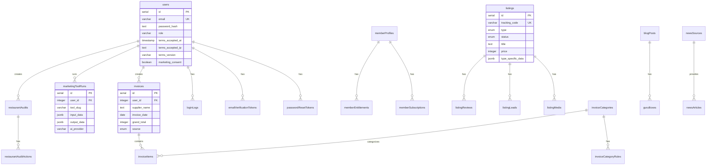

# DK Agency Data Model

Last updated: 27 May 2026 (TASK-0179C)
Schema: `lib/db/schema.ts` (single source of truth)
ORM: Drizzle | DB: Neon PostgreSQL

## Table Inventory (30 tables)

### Auth and User
| Table | Purpose |
|---|---|
| users | Istifadeci hesablari (email, password, roles, KVKK consent) |
| memberProfiles | Member profilleri (company, phone, source) |
| passwordResetTokens | Sifre sifirlama token-leri |
| emailVerificationTokens | Email tesdiq token-leri |
| loginLogs | Login tarixcesi (IP, user-agent, city, country) |
| memberSubscriptions | Abonelik planlari (provider, status, period) |
| memberEntitlements | Huquqlar (code, source, isActive) |

### Content
| Table | Purpose |
|---|---|
| heroContent | Ana sehife hero bolmesi (4 dilde, 3 stat) |
| blogPosts | Blog yazilari (4 dilde title/summary/content, paywall) |
| guruBoxes | Blog guru sitat bloklari |
| siteSettings | Sayt tenzimeleri (key-value, 4 dilde) |
| emailTemplates | Email sablonlari (template_key, audience, 4 dilde) |
| partners | Terefdaslar (logo, category, website) |

### News
| Table | Purpose |
|---|---|
| newsSources | RSS menbeleri (url, language, category) |
| newsArticles | Xeber meqaleleri (4 dilde, SEO, status) |

### Listings (Devir/Satis)
| Table | Purpose |
|---|---|
| listings | Elanlar (type, status, price, typeSpecificData JSON) |
| listingMedia | Elan medialari (url, type, sortOrder) |
| listingLeads | Elan lead-leri (name, phone, email, message) |
| listingReviews | Elan reyhleri (score, notes, decision) |

### Finance (Fatura OCR)
| Table | Purpose |
|---|---|
| invoices | Faturalar (supplier, date, total, OCR provider) |
| invoiceItems | Fatura setrleri (name, quantity, unit, price) |
| invoiceCategories | Fatura kateqoriyalari (et, sud, icki...) |
| invoiceCategoryRules | Auto-mapping qaydalari (keyword -> category) |
| invoiceImports | Toplu import tarixcesi |

### KAZAN AI and Leads
| Table | Purpose |
|---|---|
| kazanLeads | KAZAN lead-leri (name, phone, businessType, intent, context JSON) |
| leads | Umumi lead-ler (source, channel, locale, ipHash) |

### Marketing Tools
| Table | Purpose |
|---|---|
| marketingToolRuns | Alet istifade qeydleri (toolSlug, inputData, outputData, AI provider, cost) |

### Audit
| Table | Purpose |
|---|---|
| restaurantAudits | Restoran audit-leri (photos, AI analysis JSON, status) |
| restaurantAuditActions | Audit aksiyonlari (type, date, notes) |
| adminAuditLogs | Admin audit log (action, targetUser, metadata, immutable) |

## Entity Relationship Diagram

## Domain Boundaries

- **Auth domain:** users, memberProfiles, tokens, loginLogs, subscriptions, entitlements
- **Content domain:** heroContent, blogPosts, guruBoxes, siteSettings, emailTemplates, partners
- **News domain:** newsSources, newsArticles
- **Marketplace domain:** listings, listingMedia, listingLeads, listingReviews
- **Finance domain:** invoices, invoiceItems, invoiceCategories, invoiceCategoryRules, invoiceImports
- **AI domain:** kazanLeads, leads, marketingToolRuns
- **Audit domain:** restaurantAudits, restaurantAuditActions, adminAuditLogs
